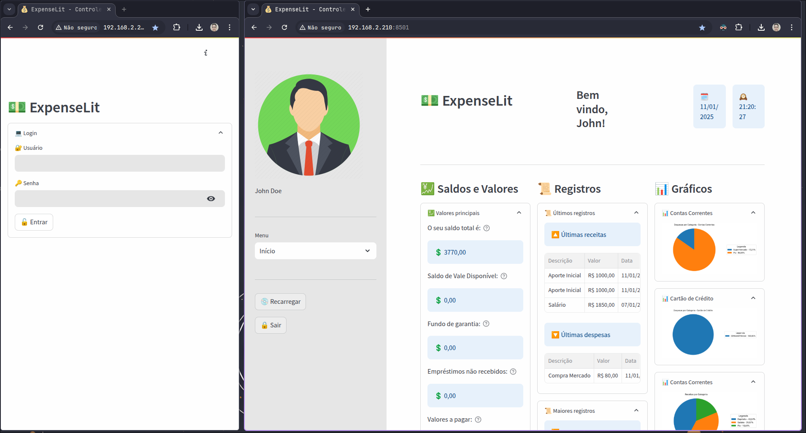
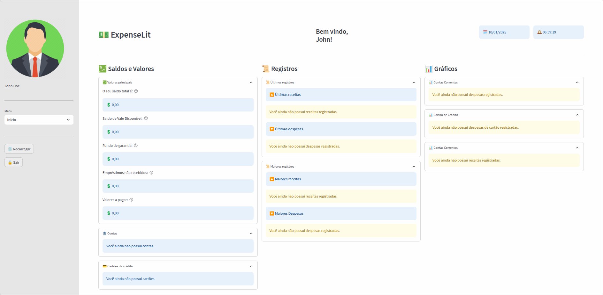
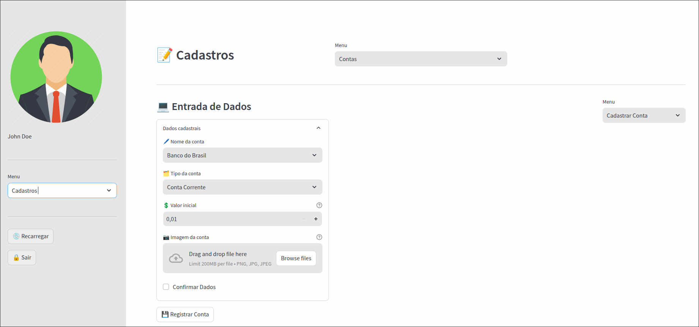
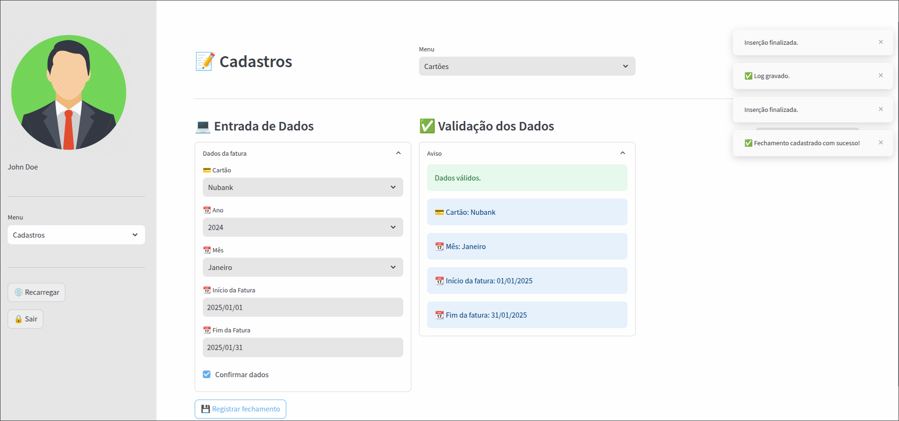
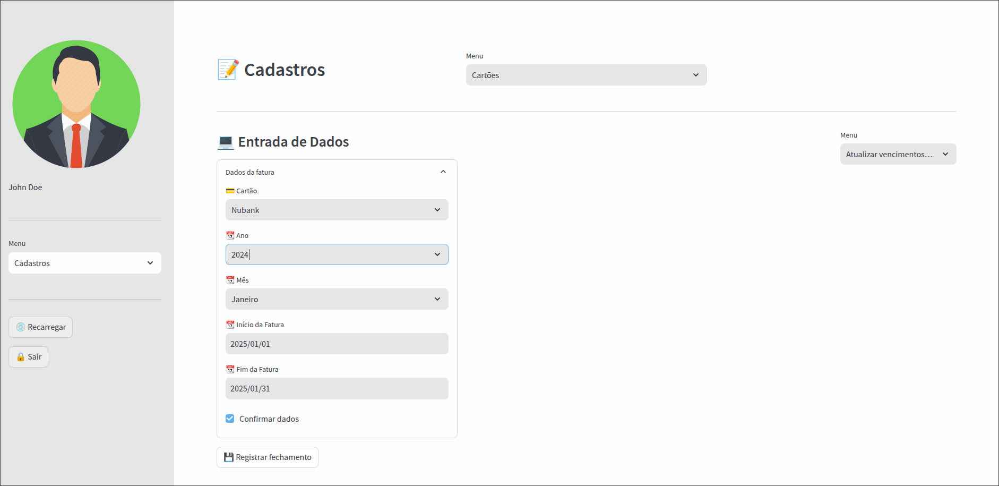

# 🚀 ExpenseLit

Um aplicativo de controle financeiro feito em **[Python](https://www.python.org/)**, através do framework **[Streamlit](https://streamlit.io/)**. Integrado ao banco de dados **[MySQL](https://www.mysql.com/)**, permite o controle de receitas e despesas, empréstimos e fundos de garantias.

## 🛠 Sobre o Projeto

Este projeto é software livre e está disponível para uso, modificação e distribuição, de acordo com os termos da licença [**MIT**](referenc/manuals/LICENSE). Ele é mantido unicamente por mim, e contribuições da comunidade são muito bem-vindas.

## ✨ Funcionalidades

- Cadastro de contas e cartões, assim como receitas e despesas;
- Relatórios gráficos para análise financeira;
- Filtros avançados por categoria, período e tipo de transação;
- Exportação de relatórios em formato PDF e consulta de comprovantes;
- Autenticação segura de usuários;
- Ferramenta para backup de dados;
- Customização do tema e fontes.

## 🚧 Limitações

- **Escalabilidade**: A solução foi projetada para uso em rede local.
- **Autenticação**: Não há suporte ao login por email e autenticação de dois fatores no momento, o que pode representar uma limitação de segurança.

## 📸 Demonstração

   
Imagens

   ---

   
   *Tela de login.*

   ---

   
   *Tela inicial mostrando o resumo financeiro.*

   ---

   
   *Tela de cadastro de contas.*

   ---

   
   *Tela de cadastro de cartões de crédito.*

   ---

   
   *Tela de cadastro de faturas de cartão.*

   ---

---

## 🛤️ Roadmap

Melhorias planejadas para futuras versões:

- Desenvolvimento de uma API para o backend do aplicativo, através do framework **[Django](https://www.djangoproject.com/)**;
- Suporte para múltiplas moedas;
- Integração com APIs de bancos para sincronização automática de faturas de cartão;
- Aplicativo móvel para Android e iOS, desenvolvido através do framework **[Flet](https://flet.dev/)**.

## 🐞 Relatório de Bugs e Problemas

Se encontrar algum bug ou problema, você pode informa-lo na aba **Issues** deste projeto. Por favor, inclua informações detalhadas, como:

- Passos para reproduzir o problema;
- Sistema operacional e ambiente;
- Mensagens de erro relevantes.

⚠️ **Atenção:** Este projeto é desenvolvido e mantido em meu tempo livre e, por isso, os bugs reportados serão analisados e corrigidos conforme a minha disponibilidade. Agradeço pela paciência e compreensão.

## Instalação

Para realizar a instalação, siga este passo a passo:

  * Clonagem do projeto:
  
      `git clone https://github.com/tarcisioribeiro/ExpenseLit.git`

  * Crie o arquivo de variáveis **.env** na raiz do projeto:

         DB_HOSTNAME=db
         DB_PORT=3306
         DB_USER=root
         DB_PASSWORD='Senha do MySQL'
         DB_NAME=financas

         MYSQL_ROOT_PASSWORD='Senha root do MySQL (deve ser igual a senha utilizada para a variável DB_PASSWORD)'

         GROQ_API_KEY='Sua chave da API do Groq.'

   * Após criar o arquivo de variáveis, faça a compilação da imagem:

      `docker build . -t expenselit-app`

   * Adicione a stack da aplicação:

      `docker stack deploy -c expenselit-app.yml expenselit`

* Acesse o aplicativo em um navegador:

   http://'seu_ip_local':8551

---

## 📜 Licença

Este projeto é licenciado sob a licença [MIT](LICENSE).

   A Licença MIT permite o uso, cópia, modificação e distribução do código do projeto, sem restrições. No entanto, a única exigência é que a licença original e o aviso de direitos autorais sejam mantidos, ou seja, deve-se deixar claro de onde o código veio.

 Sinta-se à vontade para usá-lo e modificá-lo conforme necessário.

## 📚 Referências

- [Documentação do Streamlit](https://docs.streamlit.io/)
- [MySQL Community Edition](https://dev.mysql.com/downloads/)
- [Python](https://www.python.org/)
