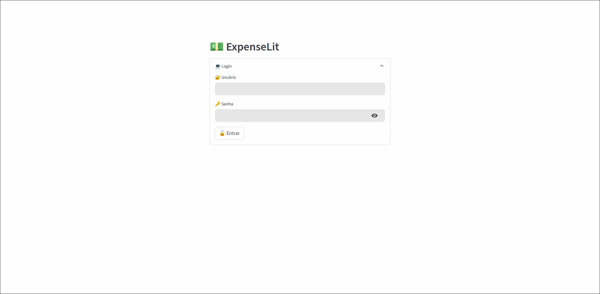
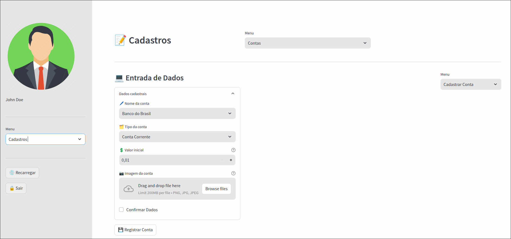
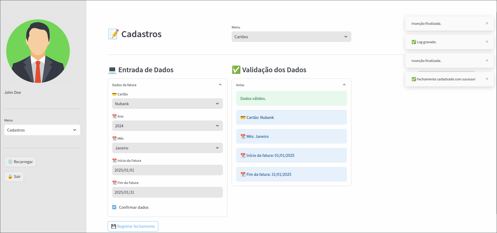
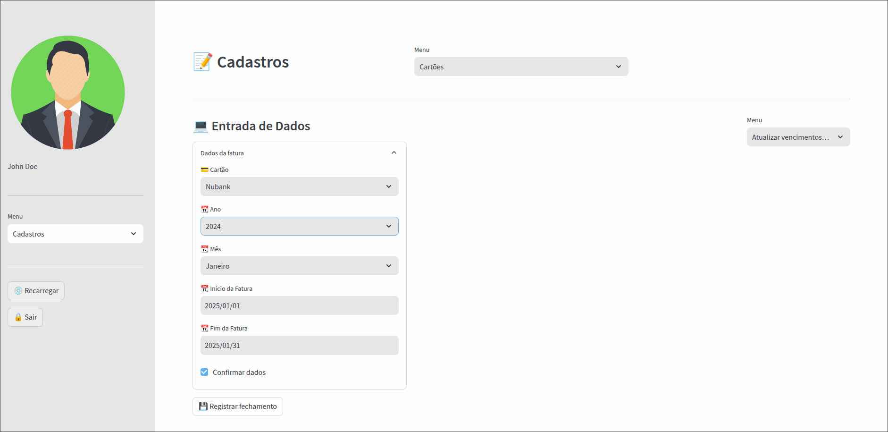

# 🚀 ExpenseLit

Um aplicativo de controle financeiro feito em **[Python](https://www.python.org/)**, através do framework **[Streamlit](https://streamlit.io/)**. Integrado ao banco de dados **[MySQL](https://www.mysql.com/)**, permite o controle de receitas e despesas.

## 🛠 Sobre o Projeto

Este projeto é software livre e está disponível para uso, modificação e distribuição, de acordo com os termos da licença [**MIT**](LICENSE). Ele é mantido unicamente por mim, e contribuições da comunidade são muito bem-vindas.

## ✨ Funcionalidades

- Cadastro de contas e cartões, assim como receitas e despesas;
- Relatórios gráficos para análise financeira;
- Filtros avançados por categoria, período e tipo de transação;
- Exportação de relatórios em formato PDF e consulta de comprovantes;
- Autenticação segura de usuários;
- Ferramenta para backup de dados;
- Customização do tema e fontes.

## 🚧 Limitações

- **Versão nativa para Windows**: Atualmente, o projeto não oferece suporte nativo para sistemas Microsoft Windows, devido a um erro na execução do Streamlit em conjunto com o conector MySQL para o Python, que faz com que o processo seja encerrado em sequência. Devido a isso, a alternativa é a execução do aplicativo através do **[Subsistema Linux para Windows](https://learn.microsoft.com/pt-br/windows/wsl/install)**;
- **Escalabilidade**: A solução foi projetada para uso em rede local, apesar de ser possível o acesso externo através do encaminhamento das portas usadas pelo Streamlit, utilizando o utilitário **[Ngrok](https://ngrok.com/)**;

- **Autenticação**: Não há suporte ao login por email e autenticação de dois fatores no momento, o que pode representar uma limitação de segurança.


## 📸 Demonstração

<details>
   <summary>Imagens</summary>

   ---

   
   *Tela de login com autenticação segura.*

   ---

   
   *Tela inicial mostrando o resumo financeiro.*

   ---

   
   *Tela de cadastro de contas.*

   ---

   
   *Tela de cadastro de cartões de crédito.*

   ---

   
   *Tela de cadastro de faturas de cartão.*

   ---

</details>

<details>
   <summary>Vídeo explicativo</summary>

   

</details>

---

## 🛤️ Roadmap

Funcionalidades planejadas para futuras versões:

- Desenvolvimento de uma versão nativa compátivel com o Windows, que permita a execução do Streamlit através de um serviço;
- Desenvolvimento de uma API para o backend do aplicativo, através do framework **[Django](https://www.djangoproject.com/)**;
- Suporte para múltiplas moedas;
- Integração com APIs de bancos para sincronização automática de faturas de cartão;
- Aplicativo móvel para Android e iOS, desenvolvido através do framework **[Flet](https://flet.dev/)**.

## 💡 Contribuições

Contribuições são sempre bem-vindas! Se quiser ajudar a melhorar o projeto, você pode:

- Propor melhorias ou novas funcionalidades via **Issues**;
- Enviar pull requests com correções de bugs ou novos recursos.

Certifique-se de ler o arquivo [CONTRIBUTING.md](CONTRIBUTING.md) antes de contribuir.

## 🐞 Relatório de Bugs e Problemas

Se encontrar algum bug ou problema, você pode relatá-lo na aba **Issues** deste repositório. Por favor, inclua informações detalhadas, como:

- Passos para reproduzir o problema;
- Sistema operacional e ambiente;
- Mensagens de erro relevantes.

⚠️ **Atenção:** Este projeto é desenvolvido e mantido em meu tempo livre e, por isso, os bugs reportados serão analisados e corrigidos conforme a minha disponibilidade. Agradeço pela paciência e compreensão.

## Instalação

<details>
   <summary>Instalação em ambiente GNU/Linux</summary>

   Pensado a ser executado em distribuições Linux de base Debian em um primeiro momento, esta aplicação possui uma instalação fácil e rápida, que deve ser feita abrindo um terminal e executando os seguintes comandos, em sequência:

   ```bash
   sudo apt update
   sudo apt upgrade -y
   mkdir -p ~/repos
   sudo apt install git unzip wget -y
   cd ~/repos
   wget https://github.com/tarcisioribeiro/ExpenseLit/archive/refs/heads/main.zip
   unzip main.zip
   mv ExpenseLit-main ExpenseLit
   cd ExpenseLit/
   sudo ./services/linux/install_service.sh
   ```

   A execução do script **install_service.sh** automaticamente realizará a instalação das dependências e configuração do ambiente da aplicação.

</details>

---

<details>
   <summary>Instalação em ambientes Microsoft Windows</summary>

   Para utilizar o ExpenseLit em ambiente **Windows**, execute o **Windows PowerShell** como **administrador**, executando em sequência os comandos abaixo:

   ```powershell
   Set-ExecutionPolicy Unrestricted
   winget install -e --id Git.Git
   cd ~
   git clone https://github.com/tarcisioribeiro/ExpenseLit.git
   .\ExpenseLit\services\windows\InstallWSL.ps1
   ```

   Após executar os comandos acima, reinicie a máquina, executando o Windows PowerShell com permissões de administrador novamente, e execute o seguinte comando:

   ```powershell
   .\ExpenseLit\services\windows\InstallWSL_Ubuntu22.04.ps1
   ```

   A execução do script **InstallWSL.ps1** automaticamente realizará a instalação do **[WSL](https://learn.microsoft.com/en-us/windows/wsl/)**, que é o Subsistema Linux para Windows. O script **InstallWSL_Ubuntu22.04.ps1** realizará a instalação do **[Ubuntu 22.04](https://ubuntu.com/download/desktop/thank-you?version=22.04&architecture=amd64)** sobre o WSL.

   #### Configuração da aplicação através do WSL

   Para instalar a aplicação no WSL pelo Ubuntu 22.04, execute a aplicação do Ubuntu 22.04 que foi instalada anteriormente, e siga o passo a passo abaixo:

   1. Ao executar o Ubuntu 22.04, será necessário definir um nome de usuário, o qual deve ser **serveruser**, para que a aplicação possa ser instalada.
      
      **OBS.:** Defina uma senha que possa lembrar, e a armazene, pois ela será utilizada algumas vezes durante a instalação.

   2. Após definir uma senha, execute os seguintes comandos na aplicação do Ubuntu 22.04:

   ```bash
   cd ~
   sudo apt update
   sudo apt upgrade -y
   mkdir -p ~/repos
   sudo apt install build-essential git curl wget neofetch net-tools unzip -y
   cd ~/repos
   wget https://github.com/tarcisioribeiro/ExpenseLit/archive/refs/heads/main.zip
   unzip main.zip
   mv ExpenseLit-main ExpenseLit
   cd ExpenseLit/
   sudo ./services/linux/install_service.sh
   ```

   3. Após executar os comandos acima, será disponibilizado através do terminal o link de acesso, o qual deve ser copiado e colado em seu navegador de preferência.

</details>

---

## 📜 Licença

Este projeto é licenciado sob a licença [MIT](LICENSE).

   A Licença MIT permite o uso, cópia, modificação e distribução do código do projeto, sem restrições. No entanto, a única exigência é que a licença original e o aviso de direitos autorais sejam mantidos, ou seja, deve-se deixar claro de onde o código veio.

 Sinta-se à vontade para usá-lo e modificá-lo conforme necessário.

## 📚 Referências

- [Documentação do Streamlit](https://docs.streamlit.io/)
- [MySQL Community Edition](https://dev.mysql.com/downloads/)
- [Python](https://www.python.org/)
