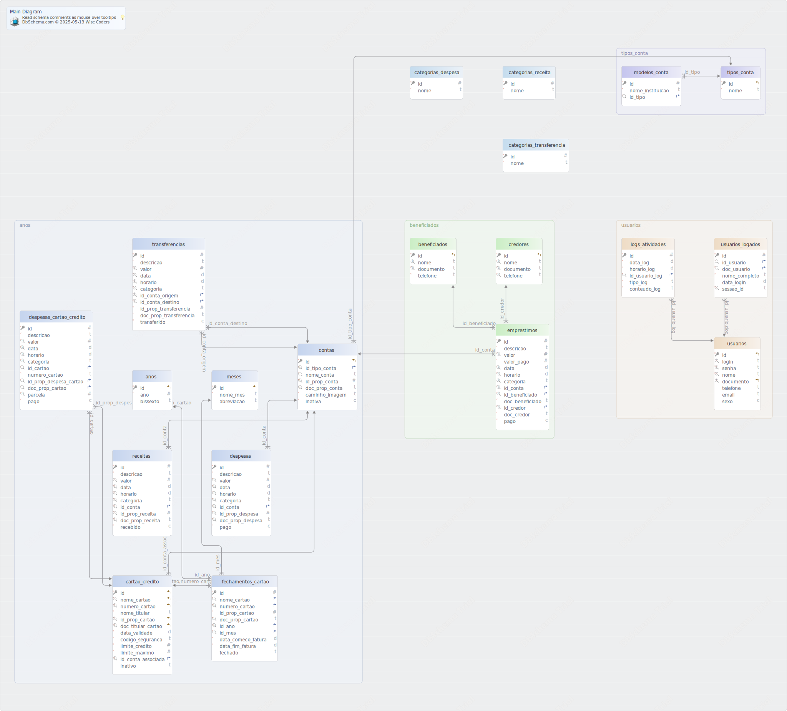

#Main Diagram
Generated using [DbSchema](https://dbschema.com)

### Main Diagram

### Table financas.anos 
|Idx |Name |Data Type |
|---|---|---|
| * &#128273;  &#11019; | id| INT AUTO_INCREMENT |
| * | ano| INT  |
|  | bissexto| VARCHAR(1)  DEFAULT '_utf8mb4'N'' |

##### Indexes 
|Type |Name |On |
|---|---|---|
| &#128273;  | pk\_anos | ON id|

##### Options 
ENGINE=InnoDB AUTO\_INCREMENT=10 DEFAULT CHARSET=utf8mb4 COLLATE=utf8mb4\_0900\_ai\_ci 

### Table financas.beneficiados 
|Idx |Name |Data Type |
|---|---|---|
| * &#128273;  &#11019; | id| INT AUTO_INCREMENT |
| &#128269; | nome| VARCHAR(100)  |
| * &#128269; | documento| VARCHAR(11)  |
| * | telefone| VARCHAR(11)  DEFAULT '0' |

##### Indexes 
|Type |Name |On |
|---|---|---|
| &#128273;  | pk\_beneficiados | ON id|
| &#128269;  | idx\_beneficiado | ON nome, documento|

##### Options 
ENGINE=InnoDB DEFAULT CHARSET=utf8mb4 COLLATE=utf8mb4\_0900\_ai\_ci 

### Table financas.cartao_credito 
|Idx |Name |Data Type |
|---|---|---|
| * &#128273;  &#11019; | id| INT AUTO_INCREMENT |
| * &#128269; &#11019; | nome\_cartao| VARCHAR(100)  |
| * &#128269; &#11019; | numero\_cartao| VARCHAR(16)  |
| * | nome\_titular| VARCHAR(100)  |
| * &#128269; &#11019; | id\_prop\_cartao| INT  |
| * &#128269; &#11019; | doc\_titular\_cartao| VARCHAR(11)  |
| * | data\_validade| DATE  |
| * | codigo\_seguranca| VARCHAR(3)  |
| * | limite\_credito| DECIMAL(10,2)  DEFAULT '0.00' |
| * | limite\_maximo| DECIMAL(10,2)  DEFAULT '0.00' |
| * &#128269; &#11016; | id\_conta\_associada| INT  |
|  | inativo| VARCHAR(1)  DEFAULT 'N' |

##### Indexes 
|Type |Name |On |
|---|---|---|
| &#128273;  | pk\_cartao\_credito | ON id|
| &#128269;  | chave\_cartao | ON numero\_cartao, doc\_titular\_cartao, id\_conta\_associada|
| &#128269;  | unq\_cartao\_credito\_nome\_cartao | ON nome\_cartao, numero\_cartao|
| &#128269;  | unq\_cartao\_credito\_id\_prop\_cartao | ON id\_prop\_cartao, doc\_titular\_cartao|
| &#128270;  | fk\_cartao\_credito\_conta | ON id\_conta\_associada|

##### Foreign Keys
|Type |Name |On |
|---|---|---|
|  | fk_cartao_credito_conta | ( id\_conta\_associada ) ref [financas.contas](#contas) (id) |

##### Options 
ENGINE=InnoDB DEFAULT CHARSET=utf8mb4 COLLATE=utf8mb4\_0900\_ai\_ci 

### Table financas.categorias_despesa 
|Idx |Name |Data Type |
|---|---|---|
| * &#128273;  | id| INT AUTO_INCREMENT |
| * | nome| VARCHAR(100)  |

##### Indexes 
|Type |Name |On |
|---|---|---|
| &#128273;  | pk\_categorias\_despesa | ON id|

##### Options 
ENGINE=InnoDB AUTO\_INCREMENT=12 DEFAULT CHARSET=utf8mb4 COLLATE=utf8mb4\_0900\_ai\_ci 

### Table financas.categorias_receita 
|Idx |Name |Data Type |
|---|---|---|
| * &#128273;  | id| INT AUTO_INCREMENT |
| * | nome| VARCHAR(100)  |

##### Indexes 
|Type |Name |On |
|---|---|---|
| &#128273;  | pk\_categorias\_receita | ON id|

##### Options 
ENGINE=InnoDB AUTO\_INCREMENT=9 DEFAULT CHARSET=utf8mb4 COLLATE=utf8mb4\_0900\_ai\_ci 

### Table financas.categorias_transferencia 
|Idx |Name |Data Type |
|---|---|---|
| * &#128273;  | id| INT AUTO_INCREMENT |
| * | nome| VARCHAR(100)  |

##### Indexes 
|Type |Name |On |
|---|---|---|
| &#128273;  | pk\_categorias\_transferencia | ON id|

##### Options 
ENGINE=InnoDB AUTO\_INCREMENT=4 DEFAULT CHARSET=utf8mb4 COLLATE=utf8mb4\_0900\_ai\_ci 

### Table financas.contas 
|Idx |Name |Data Type |
|---|---|---|
| * &#128273;  &#11019; | id| INT AUTO_INCREMENT |
| * &#128269; &#11016; | id\_tipo\_conta| INT  |
| * &#128269; | nome\_conta| VARCHAR(100)  |
| * &#128269; | id\_prop\_conta| INT  |
| * &#128269; | doc\_prop\_conta| VARCHAR(11)  |
| * | caminho\_imagem| VARCHAR(255)  DEFAULT 'default.png' |
| * | inativa| CHAR(1)  DEFAULT 'N' |

##### Indexes 
|Type |Name |On |
|---|---|---|
| &#128273;  | pk\_contas | ON id|
| &#128269;  | unq\_conta | ON id\_tipo\_conta, nome\_conta, id\_prop\_conta, doc\_prop\_conta|

##### Foreign Keys
|Type |Name |On |
|---|---|---|
|  | fk_id_tipo_conta | ( id\_tipo\_conta ) ref [financas.tipos\_conta](#tipos\_conta) (id) |

##### Options 
ENGINE=InnoDB DEFAULT CHARSET=utf8mb4 COLLATE=utf8mb4\_0900\_ai\_ci 

### Table financas.credores 
|Idx |Name |Data Type |
|---|---|---|
| * &#128273;  &#11019; | id| INT AUTO_INCREMENT |
| * &#128269; | nome| VARCHAR(100)  |
| * &#128269; | documento| VARCHAR(11)  |
| * &#128269; | telefone| VARCHAR(11)  DEFAULT '0' |

##### Indexes 
|Type |Name |On |
|---|---|---|
| &#128273;  | pk\_credores | ON id|
| &#128269;  | chave\_credor | ON nome, documento, telefone|

##### Options 
ENGINE=InnoDB DEFAULT CHARSET=utf8mb4 COLLATE=utf8mb4\_0900\_ai\_ci 

### Table financas.despesas 
|Idx |Name |Data Type |
|---|---|---|
| * &#128273;  | id| INT AUTO_INCREMENT |
| * | descricao| VARCHAR(100)  DEFAULT 'Despesa' |
| * &#128269; | valor| DECIMAL(10,2)  DEFAULT '0.00' |
| * &#128269; | data| DATE  DEFAULT curdate() |
| * &#128269; | horario| TIME  DEFAULT curtime() |
| * &#128269; | categoria| VARCHAR(100)  |
| * &#128269; &#11016; | id\_conta| INT  |
| * &#128269; | id\_prop\_despesa| INT  |
| * &#128269; | doc\_prop\_despesa| VARCHAR(11)  |
| * | pago| CHAR(1)  DEFAULT 'S' |

##### Indexes 
|Type |Name |On |
|---|---|---|
| &#128273;  | pk\_despesas | ON id|
| &#128269;  | chave\_despesa | ON valor, data, horario, categoria, id\_conta, id\_prop\_despesa, doc\_prop\_despesa|
| &#128270;  | fk\_proprietario\_despesa | ON id\_prop\_despesa, doc\_prop\_despesa|
| &#128270;  | fk\_despesas\_contas | ON id\_conta|

##### Foreign Keys
|Type |Name |On |
|---|---|---|
|  | fk_despesas_contas | ( id\_conta ) ref [financas.contas](#contas) (id) |

##### Options 
ENGINE=InnoDB DEFAULT CHARSET=utf8mb4 COLLATE=utf8mb4\_0900\_ai\_ci 

### Table financas.despesas_cartao_credito 
|Idx |Name |Data Type |
|---|---|---|
| * &#128273;  | id| INT AUTO_INCREMENT |
| * | descricao| VARCHAR(100)  DEFAULT 'Despesa Cartão' |
| * &#128269; | valor| DECIMAL(10,2)  DEFAULT '0.00' |
| * &#128269; | data| DATE  DEFAULT curdate() |
| * &#128269; | horario| TIME  DEFAULT curtime() |
| * &#128269; | categoria| VARCHAR(100)  |
| * &#128270; &#11016; | id\_cartao| INT  |
| * | numero\_cartao| VARCHAR(16)  |
| * &#128270; &#11016; | id\_prop\_despesa\_cartao| INT  |
| * &#128270; &#11016; | doc\_prop\_cartao| VARCHAR(11)  |
| * &#128269; | parcela| INT  DEFAULT '1' |
| * | pago| CHAR(1)  DEFAULT 'N' |

##### Indexes 
|Type |Name |On |
|---|---|---|
| &#128273;  | pk\_despesas\_cartao\_credito | ON id|
| &#128269;  | chave\_despesa\_cartao | ON valor, data, horario, categoria, parcela|
| &#128270;  | fk\_prop\_despesa\_cartao | ON id\_prop\_despesa\_cartao, doc\_prop\_cartao|
| &#128270;  | fk\_cartao\_despesa | ON id\_cartao|

##### Foreign Keys
|Type |Name |On |
|---|---|---|
|  | fk_cartao_despesa | ( id\_cartao ) ref [financas.cartao\_credito](#cartao\_credito) (id) |
|  | fk_prop_despesa_cartao | ( id\_prop\_despesa\_cartao, doc\_prop\_cartao ) ref [financas.cartao\_credito](#cartao\_credito) (id\_prop\_cartao, doc\_titular\_cartao) |

##### Options 
ENGINE=InnoDB DEFAULT CHARSET=utf8mb4 COLLATE=utf8mb4\_0900\_ai\_ci 

### Table financas.emprestimos 
|Idx |Name |Data Type |
|---|---|---|
| * &#128273;  | id| INT AUTO_INCREMENT |
| * | descricao| VARCHAR(100)  |
| * &#128269; | valor| DECIMAL(10,2)  DEFAULT '0.00' |
| * | valor\_pago| DECIMAL(10,2)  DEFAULT '0.00' |
| * &#128269; | data| DATE  DEFAULT curdate() |
| * &#128269; | horario| TIME  DEFAULT curtime() |
| &#128269; | categoria| VARCHAR(100)  |
| * &#128269; &#11016; | id\_conta| INT  |
| * &#128269; &#11016; | id\_beneficiado| INT  |
| * | doc\_beneficiado| VARCHAR(11)  |
| * &#128269; &#11016; | id\_credor| INT  |
| * | doc\_credor| VARCHAR(11)  |
| * | pago| CHAR(1)  DEFAULT 'N' |

##### Indexes 
|Type |Name |On |
|---|---|---|
| &#128273;  | pk\_emprestimos | ON id|
| &#128269;  | chave\_emprestimo | ON valor, data, horario, categoria, id\_conta, id\_beneficiado, id\_credor|
| &#128270;  | fk\_beneficiado\_emprestimo | ON id\_beneficiado|
| &#128270;  | fk\_conta\_emprestimo | ON id\_conta|
| &#128270;  | fk\_credor\_emprestimo | ON id\_credor|

##### Foreign Keys
|Type |Name |On |
|---|---|---|
|  | fk_beneficiado_emprestimo | ( id\_beneficiado ) ref [financas.beneficiados](#beneficiados) (id) |
|  | fk_conta_emprestimo | ( id\_conta ) ref [financas.contas](#contas) (id) |
|  | fk_credor_emprestimo | ( id\_credor ) ref [financas.credores](#credores) (id) |

##### Options 
ENGINE=InnoDB DEFAULT CHARSET=utf8mb4 COLLATE=utf8mb4\_0900\_ai\_ci 

### Table financas.fechamentos_cartao 
|Idx |Name |Data Type |
|---|---|---|
| * &#128273;  | id| INT AUTO_INCREMENT |
| * &#128270; &#11016; | nome\_cartao| VARCHAR(100)  |
| * &#128269; &#11016; | numero\_cartao| VARCHAR(16)  |
| * | id\_prop\_cartao| INT  |
| * &#128269; | doc\_prop\_cartao| VARCHAR(11)  |
| * &#128269; &#11016; | id\_ano| INT  |
| * &#128269; &#11016; | id\_mes| INT  |
| * | data\_comeco\_fatura| DATE  |
| * | data\_fim\_fatura| DATE  |
|  | fechado| VARCHAR(1)  DEFAULT 'N' |

##### Indexes 
|Type |Name |On |
|---|---|---|
| &#128273;  | pk\_fechamentos\_cartao | ON id|
| &#128269;  | chave\_fechamento\_cartao | ON numero\_cartao, doc\_prop\_cartao, id\_ano, id\_mes|
| &#128270;  | fk\_fechamentos\_cartao | ON nome\_cartao, numero\_cartao|
| &#128270;  | fk\_ano\_fechamento | ON id\_ano|
| &#128270;  | fk\_mes\_fechamento | ON id\_mes|

##### Foreign Keys
|Type |Name |On |
|---|---|---|
|  | fk_ano_fechamento | ( id\_ano ) ref [financas.anos](#anos) (id) |
|  | fk_fechamentos_cartao | ( nome\_cartao, numero\_cartao ) ref [financas.cartao\_credito](#cartao\_credito) (nome\_cartao, numero\_cartao) |
|  | fk_mes_fechamento | ( id\_mes ) ref [financas.meses](#meses) (id) |

##### Options 
ENGINE=InnoDB DEFAULT CHARSET=utf8mb4 COLLATE=utf8mb4\_0900\_ai\_ci 

### Table financas.logs_atividades 
|Idx |Name |Data Type |
|---|---|---|
| * &#128273;  | id| INT AUTO_INCREMENT |
| * | data\_log| DATE  DEFAULT curdate() |
| * | horario\_log| TIME  DEFAULT curtime() |
| * &#128270; &#11016; | id\_usuario\_log| INT  |
| * | tipo\_log| VARCHAR(100)  |
| * | conteudo\_log| TEXT  |

##### Indexes 
|Type |Name |On |
|---|---|---|
| &#128273;  | pk\_logs\_atividades | ON id|
| &#128270;  | fk\_logs\_atividades\_usuarios | ON id\_usuario\_log|

##### Foreign Keys
|Type |Name |On |
|---|---|---|
|  | fk_logs_atividades_usuarios | ( id\_usuario\_log ) ref [financas.usuarios](#usuarios) (id) |

##### Options 
ENGINE=InnoDB DEFAULT CHARSET=utf8mb4 COLLATE=utf8mb4\_0900\_ai\_ci 

### Table financas.meses 
|Idx |Name |Data Type |
|---|---|---|
| * &#128273;  &#11019; | id| INT AUTO_INCREMENT |
| * | nome\_mes| VARCHAR(20)  |
|  | abreviacao| VARCHAR(5)  |

##### Indexes 
|Type |Name |On |
|---|---|---|
| &#128273;  | pk\_meses | ON id|

##### Options 
ENGINE=InnoDB AUTO\_INCREMENT=13 DEFAULT CHARSET=utf8mb4 COLLATE=utf8mb4\_0900\_ai\_ci 

### Table financas.modelos_conta 
|Idx |Name |Data Type |
|---|---|---|
| * &#128273;  | id| INT AUTO_INCREMENT |
| * | nome\_instituicao| VARCHAR(100)  |
| * &#128270; &#11016; | id\_tipo| INT  |

##### Indexes 
|Type |Name |On |
|---|---|---|
| &#128273;  | pk\_modelos\_conta | ON id|
| &#128270;  | fk\_id\_tipo | ON id\_tipo|

##### Foreign Keys
|Type |Name |On |
|---|---|---|
|  | fk_tipo_conta | ( id\_tipo ) ref [financas.tipos\_conta](#tipos\_conta) (id) |

##### Options 
ENGINE=InnoDB AUTO\_INCREMENT=6 DEFAULT CHARSET=utf8mb4 COLLATE=utf8mb4\_0900\_ai\_ci 

### Table financas.receitas 
|Idx |Name |Data Type |
|---|---|---|
| * &#128273;  | id| INT AUTO_INCREMENT |
| * | descricao| VARCHAR(100)  DEFAULT 'Receita' |
| &#128269; | valor| DECIMAL(10,2)  DEFAULT '0.00' |
| * &#128269; | data| DATE  DEFAULT curdate() |
| * &#128269; | horario| TIME  DEFAULT curtime() |
| * &#128269; | categoria| VARCHAR(100)  |
| * &#128269; &#11016; | id\_conta| INT  |
| * &#128269; | id\_prop\_receita| INT  |
| * &#128269; | doc\_prop\_receita| VARCHAR(11)  |
| * | recebido| CHAR(1)  DEFAULT 'S' |

##### Indexes 
|Type |Name |On |
|---|---|---|
| &#128273;  | pk\_receitas | ON id|
| &#128269;  | chave\_despesa | ON valor, data, horario, categoria, id\_conta, id\_prop\_receita, doc\_prop\_receita|
| &#128270;  | fk\_proprietario\_receita | ON id\_prop\_receita, doc\_prop\_receita|
| &#128270;  | fk\_receitas\_contas | ON id\_conta|

##### Foreign Keys
|Type |Name |On |
|---|---|---|
|  | fk_receitas_contas | ( id\_conta ) ref [financas.contas](#contas) (id) |

##### Options 
ENGINE=InnoDB DEFAULT CHARSET=utf8mb4 COLLATE=utf8mb4\_0900\_ai\_ci 

### Table financas.tipos_conta 
|Idx |Name |Data Type |
|---|---|---|
| * &#128273;  &#11019; | id| INT AUTO_INCREMENT |
| * | nome| VARCHAR(100)  |

##### Indexes 
|Type |Name |On |
|---|---|---|
| &#128273;  | pk\_tipos\_conta | ON id|

##### Options 
ENGINE=InnoDB AUTO\_INCREMENT=5 DEFAULT CHARSET=utf8mb4 COLLATE=utf8mb4\_0900\_ai\_ci 

### Table financas.transferencias 
|Idx |Name |Data Type |
|---|---|---|
| * &#128273;  | id| INT AUTO_INCREMENT |
| * | descricao| VARCHAR(100)  DEFAULT 'Transferência' |
| * &#128269; | valor| DECIMAL(10,2)  |
| * &#128269; | data| DATE  DEFAULT curdate() |
| * &#128269; | horario| TIME  DEFAULT curtime() |
| * &#128269; | categoria| VARCHAR(100)  |
| * &#128269; &#11016; | id\_conta\_origem| INT  |
| * &#128269; &#11016; | id\_conta\_destino| INT  |
| * | id\_prop\_transferencia| INT  |
| * | doc\_prop\_transferencia| VARCHAR(11)  |
| * | transferido| CHAR(1)  DEFAULT 'S' |

##### Indexes 
|Type |Name |On |
|---|---|---|
| &#128273;  | pk\_transferencias | ON id|
| &#128269;  | chave\_transferencia | ON valor, data, horario, categoria, id\_conta\_origem, id\_conta\_destino|
| &#128270;  | fk\_transferencias\_despesas | ON id\_conta\_origem|
| &#128270;  | fk\_transferencias\_receitas | ON id\_conta\_destino|

##### Foreign Keys
|Type |Name |On |
|---|---|---|
|  | fk_transferencias_despesas | ( id\_conta\_origem ) ref [financas.contas](#contas) (id) |
|  | fk_transferencias_receitas | ( id\_conta\_destino ) ref [financas.contas](#contas) (id) |

##### Options 
ENGINE=InnoDB DEFAULT CHARSET=utf8mb4 COLLATE=utf8mb4\_0900\_ai\_ci 

### Table financas.usuarios 
|Idx |Name |Data Type |
|---|---|---|
| * &#128273;  &#11019; | id| INT AUTO_INCREMENT |
| * &#128269; | login| VARCHAR(25)  |
| * &#128269; | senha| VARCHAR(100)  |
| * &#128269; | nome| VARCHAR(100)  |
| * &#128269; &#11019; | documento| VARCHAR(11)  |
|  | telefone| VARCHAR(11)  |
|  | email| VARCHAR(100)  |
|  | sexo| CHAR(1)  |

##### Indexes 
|Type |Name |On |
|---|---|---|
| &#128273;  | pk\_usuarios | ON id|
| &#128269;  | chave\_usuario | ON login, senha|
| &#128269;  | unq\_usuarios\_nome | ON nome, documento|
| &#128269;  | unq\_usuarios\_id | ON id, documento|

##### Options 
ENGINE=InnoDB DEFAULT CHARSET=utf8mb4 COLLATE=utf8mb4\_0900\_ai\_ci 

### Table financas.usuarios_logados 
|Idx |Name |Data Type |
|---|---|---|
| * &#128273;  | id| INT AUTO_INCREMENT |
| * &#128270; &#11016; | id\_usuario| INT  |
| * &#128270; &#11016; | doc\_usuario| VARCHAR(50)  |
| * | nome\_completo| VARCHAR(100)  |
|  | data\_login| TIMESTAMP  DEFAULT CURRENT_TIMESTAMP |
| * &#128269; | sessao\_id| VARCHAR(100)  |

##### Indexes 
|Type |Name |On |
|---|---|---|
| &#128273;  | pk\_usuarios\_logados | ON id|
| &#128269;  | sessao\_id | ON sessao\_id|
| &#128270;  | fk\_usuario\_logado | ON id\_usuario, doc\_usuario|

##### Foreign Keys
|Type |Name |On |
|---|---|---|
|  | fk_usuario_logado | ( id\_usuario, doc\_usuario ) ref [financas.usuarios](#usuarios) (id, documento) |

##### Options 
ENGINE=InnoDB DEFAULT CHARSET=utf8mb4 COLLATE=utf8mb4\_0900\_ai\_ci 

